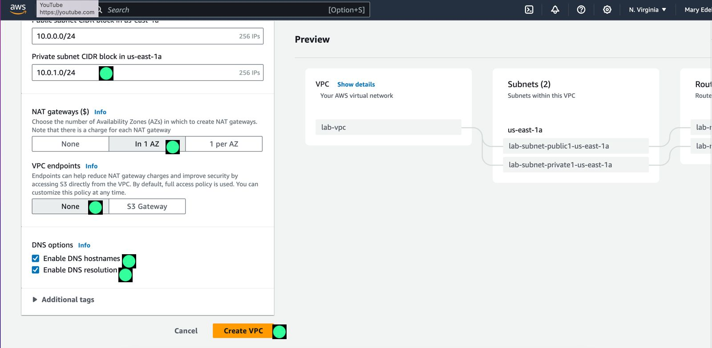

# Build-your-vpc-and-launch-a-web-server.

**A Step-by-Step Guide to Building Your VPC and Launching a Web Server on AWS.**

*Architecture diagram.*

Virtual Private Cloud (VPC) allows you to launch AWS resources into a virtual network that you defined.

In the contemporary digital arena, establishing a Virtual Private Cloud (VPC) and deploying a web server provides fundamental pillars for multiple online ventures. Amazon Web Services (AWS), a cloud computing platform, has established robust tools to create a secure VPC environment and effortlessly launch a web server in the cloud. This comprehensive guide is designed to assist you through the entire process.

# Prerequisite:

- Create VPC, and add components to produce a customized network.
- Create security group
- Configure an EC2 instance to run a web server.
- Launch the EC2 instance to run in a subnet in the VPC.

# Task 1: Create Your VPC.

- Let's start by creating a VPC. Make sure you are in the **N. Virginia (us-east-1)** region.
- Where the service button is positioned, click on it and search for VPC, click on it, and next click on **Create VPC.**

*VPC dashboard.*

**1. Configure the VPC details:**

- Choose **VPC and more.**
- Under **Name tag auto-generation**, keep **Auto-generate** selected, however, change the value from project to **lab**
- Keep the **IPv4 CIDR block** set to **10.0.0.0/16**

*VPC Configuration process.*

- For the **Number of Availability Zones**, choose **1.**
- For the **Number of public subnets**, keep the **1** setting.
- For the **Number of private subnets**, keep the **1** setting.
- Expand the **Customize subnets CIDR blocks** section

 Change **Public subnet CIDR block** in us-east-1a to **10.0.0.0/24**
 Change **Private subnet CIDR block** in us-east-1a to **10.0.1.0/24**

*VPC Configuration process.*

- Set **NAT gateways** to In **1 AZ.**
- Set **VPC endpoints** to **None.**
- Keep both **DNS hostnames** and **DNS resolution enabled.**
- Then click on the **`Create VPC`** button.

*Configuration end page.*

**Note:** The VPC wizard has created a VPC with a public subnet and a private subnet on one availability zone with route tables for each subnet. And also an internet Gateway and NAT Gateway.

*created VPC network.*

# Task 2: Create Additional Subnets:

Here, create two additional subnets to the ones previously provisioned, a private and a public subnet in a second availability zone. 
Having subnets in multiple Availability zones within a VPC is useful for deploying a solution that provides high availability.

- On the left navigation pane, choose **Subnet**, and create a public subnet first.
- Choose **Create subnet** then configure:

  
  
- VPC ID: **lab-vpc** (select from the menu).
- Subnet name: **lab-subnet-public2**

 

- Availability Zone: Select the second Availability Zone (for example, us-east-1b)
- IPv4 CIDR block: **10.0.2.0/24**

 

- Choose **Create subnet**.

 

- Now, create the second private subnet.
- Choose **Create subnet** then configure:

 

- VPC ID: **lab-vpc**
- Subnet name: **lab-subnet-private2**

  
  
- Availability Zone: Select the second Availability Zone (for example, us-east-1b)
- IPv4 CIDR block: **10.0.3.0/24**
- Choose **Create subnet**

   
